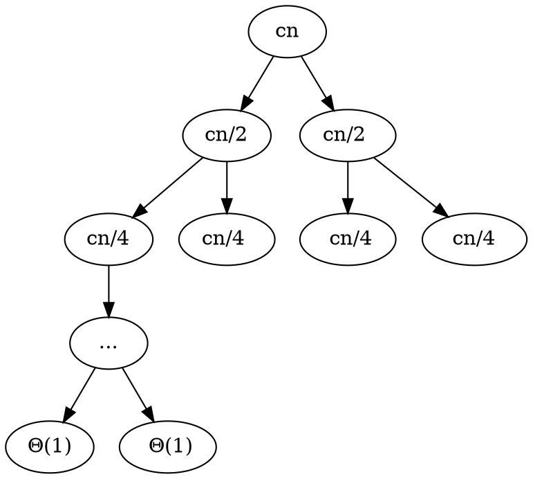

[ALGO] Complexite des algorithmes (3)
===

[// cours pdf](https://www.lrde.epita.fr/~adl/ens/algo/algo.pdf)

## Complexites

- $\Omega, \Theta, O$ -> parle de la forme d'une fonction de n quand $n \to +\infty$

> $\Theta(n^2)$ = une fonction quadratique
> $\Theta(n)$ = une fonction lineaire

- $\Theta(n^2) + \Theta(n) = \Theta(n^2)$
- $\Theta(n^2) * \Theta(n) = \Theta(n^3)$

++Exemple++
$(3n+7) \times (4n^2+7n-3) = \Theta(n) \times \Theta(n^2) = \Theta(n^3)$
> $T(n) = an^2+bn+c$  

$O(n)$ :
- Une fonction qui au pire est lineaire 
- **Est dominee par une fonction lineaire**

> $3n+2 = O(n)$
> $3n+2 = O(n^2)$
> $4 = O(n)$

- $O(n) + O(n) = O(n)$
- $O(n) + O(n^2) = O(n^2)$
- $O(n) \times O(n^2) = O(n^3)$

---
> $\Theta(n + n^2) = \Theta(n^2)$
- $\Theta(f(n)+g(n)) = \Theta(max(f(n), g(n))$
- $O(f(n)+g(n)) = O(max(f(n), g(n))$ 

---
$\Omega(n)$ : **Une fonction qui domine une fonction lineaire**

++Exemple++ : $n^2 = \Omega(n)$

- $\Omega(n) \times \Omega(n^2) = \Omega(n^3)$

## Combinaisons

$O(n) \times \Theta(n^2) = O(n^3)$
> Ex: $2n * (4n^2+2n) = 8n^3 + 4n^2$
> $\sqrt{n} * n = n^{2,5}$

- $\Theta(n) - \Theta(n) = O(n)$
> $2n - n = n$
> $2n - (2n-1) = 1$
> $2n - 2n = 0$
> $n - 2n = -n$

## Definitions

==**Definition $\Theta(g(n))$**==

$\Theta(g(n)) = \begin{cases}f(n) | \exists c_1 > 0,\ \exists c_2 > 0,\ \exists n_0 \in  N, \\ \forall n \geq n_0,\ c_1g(n) \leq f(n) \leq c_2g(n)\end{cases}$

++Exemple++ : 
Montrer que $3n^2+n \in \Theta(n^2)$
$c_1n^2 \leq 3n^2+n \leq c_2n^2$,  avec $c_1 = 3$ et $c_2 = 4$

---
==**Definition $O(g(n))$**==

$O(g(n)) = \begin{cases} f(n)\ |\ \exists c_2 > 0,\ \exists n_0 \in N, \\ \forall n > n_0,\ |f(n)| \leq c_2g(n)\end{cases}$

++Exemple++ : 
Montrer que $3n = O(n^2)$
Car $\forall n, 3n \leq c_2n^2$ avec $n_0 = 0$ et $c_2 = 3$

Montrer que $3n = O(n)$
Car $\forall n, 3n \leq c_2n$ avec $n_0 = 0$ et $c_2 = 3$ 

Montrer que $10cos(n) = O(1)$
Car $|10cos(n)| \leq c_2 \times 1$ avec $n_0 = 0$ et $c_2 = 10$

---
==**Definition $\Omega(g(n))$**==

$\Omega(g(n)) = \begin{cases} f(n) | \exists c_1 > 0,\ \exists n_0 \in N \\ \forall n \geq 0,\ c_1g(n) \leq f(n)\end{cases}$

++Exemple++ : 
Montrer que $\frac{n}{10} \in \Omega(\sqrt{n})$
$c_1\sqrt{n} \leq \frac{n}{10}$ avec $c_1 = \frac{1}{10}$
$\forall n \geq 1,\ \frac{\sqrt{n}}{10} > \frac{n}{10}$

### Notations
On note $f(n) = \Theta(g(n))$ au lieu de $f(n) \ in \Theta(g(n))$ par abus de notation.
De meme, $\Theta(n) + \Theta(n^2) = \Theta(n^2)$ signifie $\forall f_1(n) \in \Theta(n), \forall f_2(n) \in \Theta(n^2), \exists g(n) \in \Theta(n^2)$ tel que $f_1(n) + f2(n) = g(n)$

:::info 
Ces equations se lisent de gauche a droite

On a $\Theta(n) = O(n)$ mais pas $O(n) = \Theta(n)$
> $\Theta(n) \subseteq O(n)$
:::

## Algorithmes de tri

### SelectionSort 

```
SelectionSort(A, n) : 
    for i <- 0 to n - 2
        posmin <- i
        for j <- i + 1 to n - 1
            if A[j] < A[posmin]
                posmin <- j
        A[posmin] <-> A[i]
```

|Ligne de code|Ordre de grandeur|
|:--:|:--:|
|for i <- 0 to n - 2|$\Theta(n)$|
|posmin <- i|$\Theta(n)$|
|for j <- i + 1 to n - 1|$\Theta(n^2)$|
|if A[j] < A[posmin]|$\Theta(n^2)$|
|posmin <- j|$O(n^2)$ (borne sup)|
|A[posmin] <-> A[i]|$\Theta(n)$|
|||
|Total|$\Theta(n^2)$|

### InsertionSort

```
InsertionSort(A, n):
    for i <- 1 to n - 1
        key <- A[i]
        j <- i - 1
        while j >= 0 and A[j] > key 
            A[j+1] <- A[j]
            j <- j - 1
        A[j + 1] <- key
```

|Ligne de code|Ordre de grandeur|
|:---:|:---:|
|for i <- 1 to n - 1|$\Theta(n)$|
|key <- A[i]|$\Theta(n)$|
|j <- i - 1|$\Theta(n)$|
||best \| worst \| any|
|while j >= 0 and A[j] > key|$\Theta(n)\|\Theta(n^2) \| \Theta(n^2)$|
|A[j+1] <- A[j]|$0 \| \Theta(n^2) \| \Theta(n^2)$|
|j <- j - 1|$0 \| \Theta(n^2) \| \Theta(n^2)$|
|A[j + 1] <- key|$\Theta(n)$|
|||
|Total|$\Theta(n) \| \Theta(n^2) \| \Theta(n^2)$|

En general on peut dire $T(n) = O(n^2)$
:::danger
Cette notation ne garantit pas qu'un cas est quadratique !!
:::

### MergeSort

```
MergeSort(A, b, e):
    if e - b > 1:
        m <- b + (e - b) / 2
        MergeSort(A, b, m)
        MergeSort(A, m, e)
        Merge(A, b, m, e)
```
```
Merge(A, b, m, e):
    i <- b; j <- m
    for k <- b to e - 1
        if j >= e or (i > m and A[i] <= A[j])
            B[k] <- B[i]; ++i
        else
            B[k] <- B[j]; ++j
    A[b...e-1] <- B[b...e-1]
            
```
> Ou b = begin et e = end
> On travaille sur la zone du tableau entre [b,e[

On pose n = e-b
|Merge|Ordre de grandeur|
|:---:|:---:|
|i <- b; j <- m|$\Theta(1)$|
|for k <- b to e - 1|$\Theta(n)$|
|if j >= e or (i > m and A[i] <= A[j])|$\Theta(1)$|
|B[k] <- B[i]; ++i|$\Theta(n)$|
|B[k] <- B[j]; ++j|$\Theta(n)$|
|A[b...e-1] <- B[b...e-1]|$\Theta(n)$|
|||
|Total|$\Theta(n)$|

|MergeSort|Ordre de grandeur|
|:---:|:---:|
|if e - b > 1|$\Theta(1) \| \Theta(1)$|
|m <- b + (e - b) / 2|$0 \| \Theta(1)$|
|MergeSort(A, b, m)|$0 \| T_{MS}(\lfloor n/2\rfloor)$|
|MergeSort(A, m, e)|$0 \| T_{MS}(\lceil n/2\rceil)$|
|Merge(A, b, m, e)|$0 \| \Theta(n)$|
|||
|Total|$\Theta(n)$|

> $T_{MS}(n) = \begin{cases}\Theta(1) si n \leq 1 \\ T_{MS}(\lfloor n / 2\rfloor) + T_{MS}(\lceil n / 2\rceil) + \Theta(n)\ sinon\end{cases}$
> 
Pour simplifier, supposons $n = 2^k$
Alors $T_{MS}(n) = 2T_{MS}(n/2) + \Theta(n)$ pour n > 1

### Arbre des appels recursifs (avec tableau de taille n)


> On a n feuilles
Chaque ligne a un cout de $cn (= \Theta(n))$ et la derniere $n \times \Theta(1) (= \Theta(n))$
> Hauteur de l'arbre : $log_2n + 1 (\frac{n}{2^n} = 1)$

Donc $T_{MS} = \Theta(n) \times (1 + log_2n) = \Theta(n) \times \Theta(log_2n) = \Theta(nlog_2n) = \Theta(nlogn)$

> $log_3n = \Theta(log_2n)$ ? Y
> $log_3n = \frac{log_2n}{log_3n}$