[ALGO] Complexite des algorithmes (4)
===

## Methode par substitution

$\begin{align}T(n) &= 2T(n/2) + cn \\
&= 2(2T(n/4) +c(n/2)) + cn \\
&= 4T(n/4) + cn + cn \\
&= 4(2T(n/8) + c(n/4)) + 2cn \\
&= 8T(n/8) + 3cn\end{align}$

Apres $i - 1$ substitution : 

$\begin{align}T(n) &= 2^iT(n/2^i) + icn\end{align}$

La recursion s'arrete quand $(n/2^i) = 1 \iff i = log_2n$
Alors $T(n/2^{log_2n}) = T(1) = \Theta(1)$

$\begin{align}T(n) &= 2^{log_2n}T(n/2^{log_2n}) + (log_2n)cn \\
&= n\Theta(1) + cnlog_2n \\
&= \Theta(nlogn)\end{align}$

## Theoreme general

==**Theoreme general pour resoudre les equations de complexite rescursive de la forme**==

$$T(n) = aT(\frac{n}{b} + O(1)) + f(n)\ pour\ n \geq n_0$$

Avec $b > 1,\ a \geq 1$
> (Pour $n > n_0,\ T(n) = \Theta(1)$)

- Si $f(n) = O(n^{log_b(a) - \varepsilon})$ avec $\varepsilon > 0$, alors $T(n) = \Theta(n^{log_ba})$
- Si $f(n) = \Theta(n^{log_ba})$, alors $T(n) = \Theta(n^{log_ba}logn)$
- Si $f(n) = \Omega(n^{log_b(a) + \varepsilon})$ avec $\varepsilon > 0$, et de plus $\exists c < 1$ tel que $af(n/b) \leq cf(n)$ alors $T(n) = \Theta(f(n))$
- Sinon c'est dommage.


## Applications

- ++Exercice 1++ : 
$T(n) = T(\lfloor n/2 \rfloor) + T(\lceil n/2 \rceil) + \Theta(n)$
> $\lfloor n/2 \rfloor = n/2 = O(1)$
> $\lceil n/2 \rceil = n/2 = O(1)$

$T(n) = 2T((n/2) + O(1)) + \Theta(n)$
> Avec $a = b = 2$ et $log_22 = 1$

$\Theta(n) = O(n^{1 - \varepsilon})\ ou\ \Theta(n^1)\ ou\ \Omega(n^{1 + \varepsilon})$ ?
Ici $\Theta(n) = \Theta(n^1) \Rightarrow T(n) = \Theta(nlogn)$

- ++Exercice 2++ : 
$T(n) = 2T(n/3) + \sqrt{n}$
> Avec $a = 2, b = 3$ et $log_32 \simeq 0,63...$

$n^{0,5} = sqrt(n) = O(n^{log_32 - \varepsilon})$ si $\varepsilon = 0,1 \Rightarrow T(n) = \Theta(n^{log_32}) (\neq \Theta(n^{0,63}))$

- ++Exercice 3++ : 
$T(n) = 2T(n/2) + n^2$
> Avec $a = b = 2$ et $log_22 = 1$

$n^2 = \Omega(n^{1 + \varepsilon})$ si $\varepsilon = 1 \Rightarrow$ et de plus avec $c = (1/2) < 1$ on a bien $af(n/b) > cf(n) \iff 2(n/2)^2 \leq cn^2 \iff (n^2/2) \leq cn^2$

$\Rightarrow T(n) = \Theta(n^2)$

- ++Exercice 4++ : 
$T(n) = 2T(n/2) + nlog_2n$
> Avec $a = b = 2 \Rightarrow log_22 = 1$

$nlog_2n = \Omega(n^{1 + \varepsilon}) \iff \exists d > 0, \exists n_0 \in N, \forall n \geq n+0. dn^{1 + \varepsilon} \leq nlog_2n \iff d \leq \frac{log_2n}{n^{\varepsilon}} \underset{n \to +\infty}\to 0$ >> d n'existe pas

Par substitution : 
$\begin{align}T(n) &= 2T(n/2) + nlog_2n \\
&= 2(2T(n/4) + (n/2)log_2(n/2)) + nlog_2n \\
&= 4T(n/4) + nlog_2n(n/2) + nlog_2n \\
&= 4(2T(n/8) + (n/4)log_2(n/4)) + nlog_2(n/2) + nlog_2n \\
&= 8T(n/8) + nlog_2n(n/4) + nlog_2(n/2) + nlog_2n\end{align}$

Apres $i-1$ substitutions : 
$\begin{align}T(n) &= 2^iT\frac{n}{2^i} + n\sum_{k = 0}^{i-1} log_2\frac{n}{2^k} \\ 
&= 2^iT\frac{n}{2^i} + n\sum_{k = 0}^{i-1}(log_2(n) - k) \\ 
&= 2^iT\frac{n}{2^i} + nilog_2n - n\sum_{k=0}^{i-1}k \\
&= 2^iT\frac{n}{2^i} + nilog_2n - n\frac{(i-1)i}{2}\end{align}$

> $n/2^i = 1$ quand $i = log_2n$

$\begin{align}T(n) &= 2^{log_2n}T(\frac{n}{2^{log_2n}}) + n(log_2n)^2 - \frac{((log_2n) - 1)log_2n}{2}n \\
&= \Theta(n) + \Theta(n(log_2n)^2)\end{align}$

Donc $T(n) = \Theta(n(log_2n)^2)$

## HeapSort

#### ==Arbre parfait==
C'est un arbre binaire dont tous les niveaux sont pleins sauf le dernier ou toutes les feuilles sont a gauche.


Peuvent etre stockes dans un tableau sans pointeur
|100|19|36|17|3|25|1|2|7|
|:---:|:---:|:---:|:---:|:---:|:---:|:---:|:---:|:---:|
|0|1|2|3|4|5|6|7|8|

```
LeftChild(i) = 2i + 1
RightChild(i) = 2i + 2
Parent(i) = ⌊(i - 1) / 2⌋
```

#### ==Tas Max==
C'est un arbre parfait ou chaque sommet est plus grand que ses fils
Plusieurs Tas Max peuvent representer le meme ensemble de valeurs

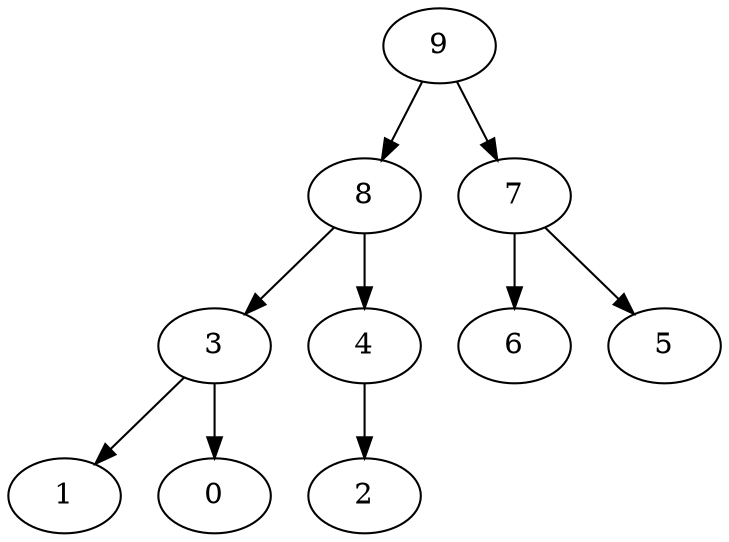

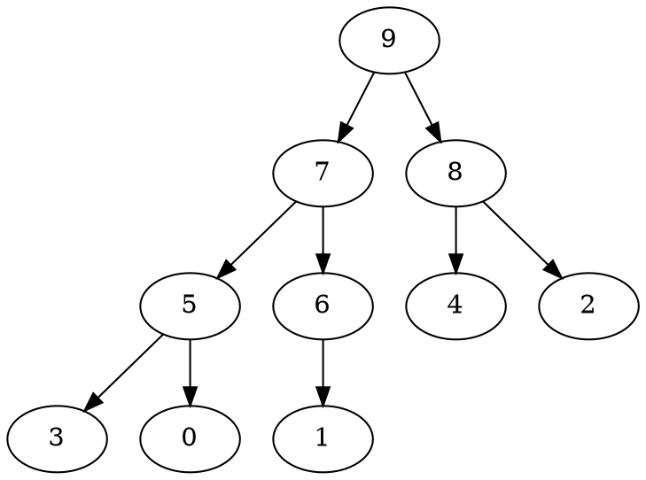

### Suppression du max

On supprime l'element max qu'on remplace par le dernier element du tableau, puis on permute avec son plus grand fils recursivement


- Suppression du 9

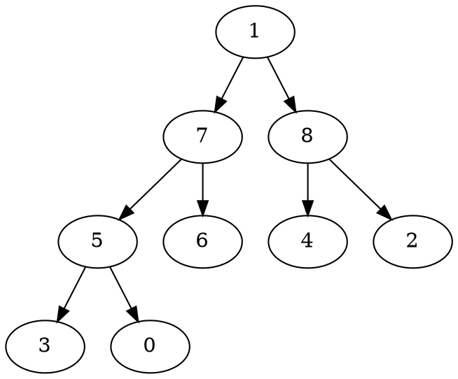

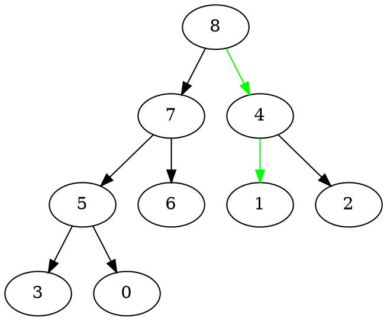

- Suppression du 8 
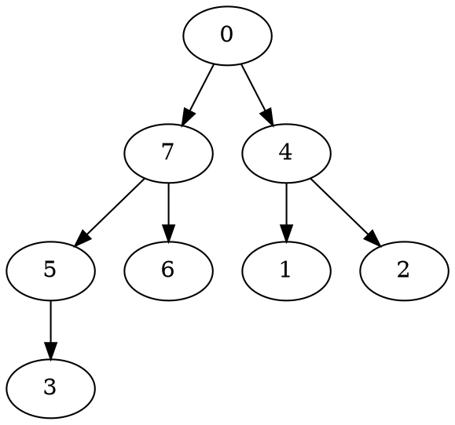

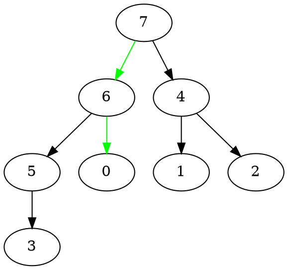

**L'idee du tri par tas :**
1. Construction du tas pour les valeurs a trier
2. Retirer les max les uns apres les autres pour remplir le tableau par la droite

### Construire un tas

Exemple : 2 3 1 4 5 7 0 9 6 8 

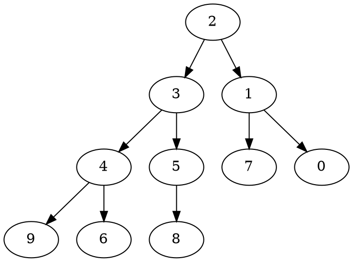

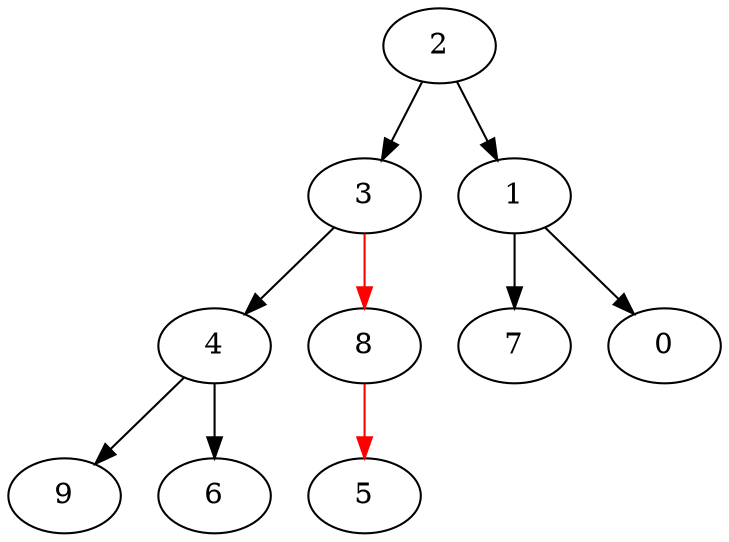

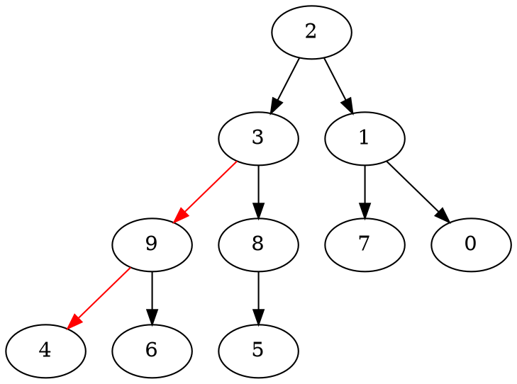


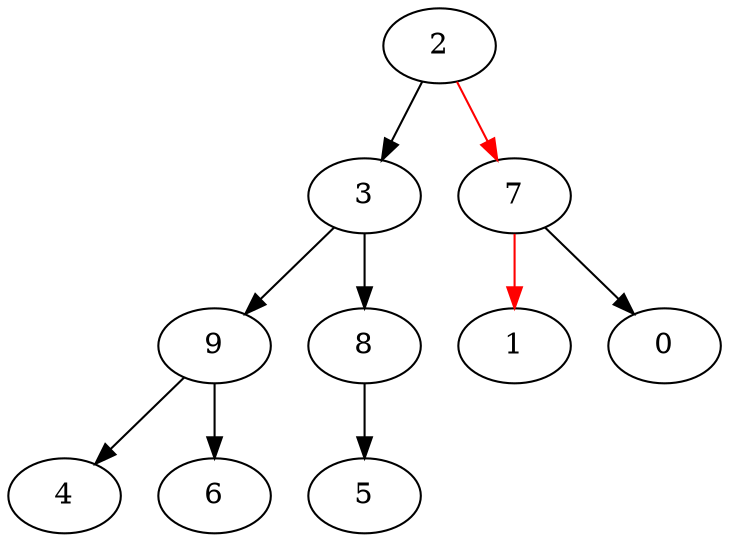

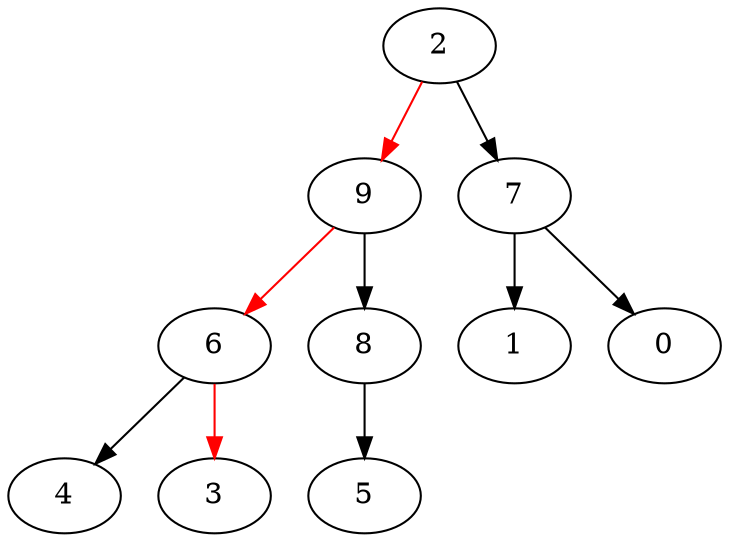

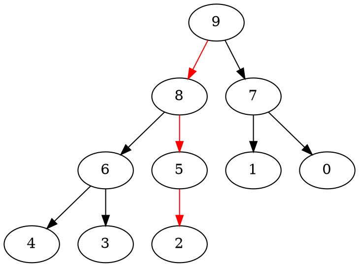

### Heapify

> Sommet i tel que le FD et FG sont des fils >> Le sommet i est la racine d'un tas

```
Heapify(A, i, n):
    l <- LeftChild(i)
    r <- RightChild(i)
    if l < n and A[l] > A[i]
        largest <- l
    else 
        largest <- i
    if r < n and A[r] > A[largest]
        largest <- r
    if largest != i
        A[i] <-> A[largest]
        Heapify(A, largest, n)
```

```
BuildHeap(A, n):
    for i <- n/2 down to 0
        Heapify(A, i, n)
```

```
HeapSort(A, n)
    BuildHeap(A, n)
    for i <- n - 1 down to 1
        A[i] <-> A[0]
        Heapify(A, 0, i)
```