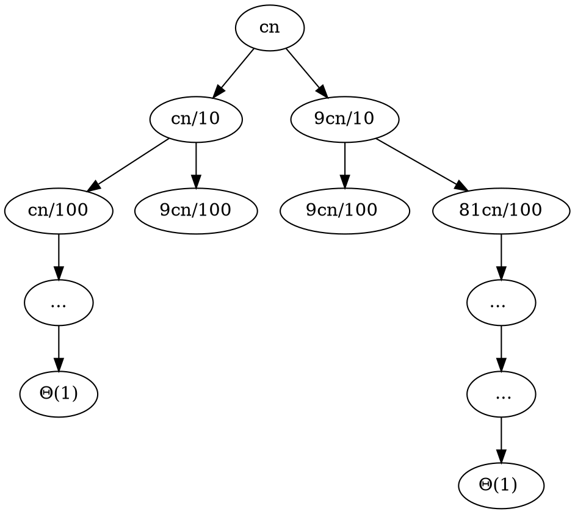

[ALGO] Complexite des algorithmes (5)
===

## Complexite de Heapify


```
Heapify(A, i, n):
    l <- LeftChild(i)
    r <- RightChild(i)
    if l < n and A[l] > A[i]
        largest <- l
    else 
        largest <- i
    if r < n and A[r] > A[largest]
        largest <- r
    if largest != i
        A[i] <-> A[largest]
        Heapify(A, largest, n)
```

Mesurer la taille du sous-probleme considere
- On pose s la taille du sous-arbre de racine i.
- On pose h la hauteur du sous-arbre

|Ligne de code|Cout|$T_H(h)$|
|:---:|:---:|:---:|
|l <- LeftChild(i)|$\Theta(1)$|$\Theta(1)$|
|r <- RightChild(i)|$\Theta(1)$|$\Theta(1)$|
|if l < n and A[l] > A[i]|$\Theta(1)$|$\Theta(1)$|
|largest <- l|$\Theta(1)$|$\Theta(1)$|
|largest <- i|$\Theta(1)$|$\Theta(1)$|
|if r < n and A[r] > A[largest]|$\Theta(1)$|$\Theta(1)$|
|largest <- r|$O(1)$|$\Theta(1)$|
|if largest != i|$\Theta(1)$|$\Theta(1)$|
|A[i] <-> A[largest]|$O(1)$|$\Theta(1)$|
|Heapify(A, largest, n)|$\leq Th((2/3)s)$|$\leq T_h(h-1)$|

> Au pire, $s = 3x + 2 \iff s/3 \geq (s  - 2) / 3 = x \iff 2x+1 = \frac{2s - 4 + 3}{3} = \frac{2s-1}{3}$

- $T_H(s) \leq \Theta(1) + T_H((2/3)s)$

Le theoreme general fonctionne pour $u(s) = u((2/3)s) + \Theta(1)$ avec a=1 b=(3/2) et $log_{3/2}1 = 0$
$\Theta(1) = \Theta(n^0) \Rightarrow u(s) = \Theta(log s)$
$T_H(s) \leq U(s)$
$T_H(s) = O(log s)$

- $T_H(h) \leq T_H(h-1) + \Theta(1)$

$T_H(h) \leq T_H(h-1) + \Theta(1)$
$T_H(h) \leq T_H(h-2) + \Theta(1) + \Theta(1)$
$T_H(h) \leq T_H(h-3) + \Theta(1) + \Theta(1) + \Theta(1)$
...
$T_H(h) \leq T_H(0) + \Theta(1) + \Theta(1) + ... + \Theta(1)$
$T_H(h) \leq (h-1)\Theta(1) = \Theta(h)$

$T_H(h) = O(h)$

## Complexite de BuildHeap

```
BuildHeap(A, n):
    for i <- n/2 down to 0
        Heapify(A, i, n)
```

|Ligne de code|Cout|
|:---:|:---:|
|for i <- n/2 down to 0|$\Theta(n)$|
|Heapify(A, i, n)|$O(nlogn)$|
> $O(nlogn)$ avec $nlogn$ a la louche

**S(h, n)** est le nombre de sous-arbres de hauteur h dans un arbre de n noeuds.

Donc *Heapify(A, i, n)* a un cout de $\begin{align}\sum_{h=1}^{\lfloor log_2n\rfloor}O(h) \times S(h, n) \leq \sum_{h=1}^{\lfloor log_2n\rfloor}O(h) \times \frac{n}{2^h} = nO(\sum_{h=1}^{\lfloor log_2n\rfloor}h(\frac{1}{2})^h)\end{align}$

## Complexite de HeapSort

```
HeapSort(A, n)
    BuildHeap(A, n)
    for i <- n - 1 down to 1
        A[i] <-> A[0]
        Heapify(A, 0, i)
```

|Ligne de code|Cout|
|:---:|:---:|
|BuildHeap(A, n)|$\Theta(n)$|
|for i <- 0 down to 1|$\Theta(n)$|
|A[i] <-> A[0]|$\Theta(n)$|
|Heapify(A, 0, i)|$\sum_{i=1}^{n-1}O(log i) = O(nlogn)$|

$\sum_{i=1}^{n-1}O(log i) = O(\sum_{}^{}log_2i) = O(log_2 \prod_{i=1}^{n-1} i) = O(log_2(n-1)!) = O((n-1)log(n-1)) = O(nlogn)$

==**Formule de Stirling**==

$\begin{align}n! = \sqrt{2\pi n}(\frac{n}{e})^n(1 + O(\frac{1}{n}))\end{align}$
$\begin{align}log_2(n!) = (1/2)log_2(2\pi n) + nlog_2n - nlog_2e + log_2(1 + O(\frac{1}{2})) = \Theta(nlogn)\end{align}$

$\begin{align}\sum_{i=1}^{n-1}log_2i = sum_{i=2}^{n-1}log_2i\end{align}$
$\begin{align}\int_{1}^{n-1}log_2idi \leq \sum_{i=2}^{n-1}log_2i \leq \int_{2}^{n}log_2idi\end{align}$
$\begin{align}[ilog_2\frac{i}{e}]_{1}^{n-1} \leq \_\_\_ \leq [ilog_2\frac{i}{e}]_{2}^{n-1}\end{align}$
$\begin{align}\Theta(nlogn) = \Theta((n-1)log(n-1)) \leq \_\_\_ \leq  \Theta(nlogn)\end{align}$

Donc $T_{HS} = O(nlogn)$

------------
## QuickSort

```
QuickSort(A,b,e)
//trie A[b...e-1]
    if e - b > 1:
        m = Partition(A,b,e)
        QuickSort(A,b,m)
        QuickSort(A,m,e)
```

```
Partition(A,b,e):
    i <- b - 1; j <- e; p = A[b]
    for ever:
        do ++i until A[i] >= p
        do --j until A[j] <= p
        if i > j
            A[i] <-> A[j]
        else
            return i + (b == i)
```

### Partition - fonctionnement
|(2) 4 8 6 1 7 5 3|
|:--:|
|1 4 8 6 2 7 5 3|
|(4) 8 6 2 7 5 {3}|
|3 [8] 6 {2} 7 5 4|
|3 2 [6] {8} 7 5 4|
|etc|
> (x) : pivot
> [i] et {j}

### Cout Partition


|Ligne de code| Cout ($T_p(n$))|
|:--:|:--:|:--:|
|i <- b - 1; j <- e; p = A[b]|$\Theta(1)$|
|for ever:|$O(n)$|
|do --j until A[j] <= p|$\Theta(n)$|
|if i > j|$O(n)$|
|A[i] <-> A[j]|$O(n)$|
|return i + (b == i)|$\Theta(1)$|

### Cout QuickSort

|Ligne|Cout ($T_Q(n)$)|
|:--:|:--:|
||$n \leq 1$ \| n > 1|
||$Theta(1)$ \| $Theta(1)$|
||0 \| $Theta(n)(?)$|
||0 \| $T_Q(1)$|
||0 \| $T_Q(n-1)$|

++Tableau trie++ : 
$T_Q(n) = \Theta(n) + T_Q(1) + T_Q(n-1)$
$T_Q(n) = T_Q(n-1) + \Theta(n)$
$= T_Q(n - 2) + \Theta(n-1) + \Theta(n)$
$= T_Q(n - 3) + \Theta(n-2) + \Theta(n-1) + \Theta(n)$
$= \sum_{i=0}^{n - 1}n - i = \Theta(n^2)$

++Cas favorable++ : 
On suppose toutes les partitions de la forme |50%|50%|

$T_Q(n) = \Theta(n) + 2T(n/2)$
$\Rightarrow T_Q(n) = \Theta(nlogn)$

++Autre cas++ : 
On supprime toutes les partitions de la forme |10%|90%|

$T_Q(n) = \Theta(n) + T_Q(n/10) + T_Q(9n/10)$



> $h_{gauche} = log_{10}n$
> $h_{droite} = log_{10/9}n$

$\Theta(nlogn) \leq T_Q(n) \leq \Theta(nlogn)$
Donc $T_Q(n) = \Theta(nlogn)$

++Autre cas++ : 
|20|n-20|

$T_Q(n) = \Theta(n) + T_Q(20) + T_Q(n - 20)$
$T_Q(n) = \Theta(n) + T_Q(n - 20)$
$T_Q(n) = \Theta(n^2)$