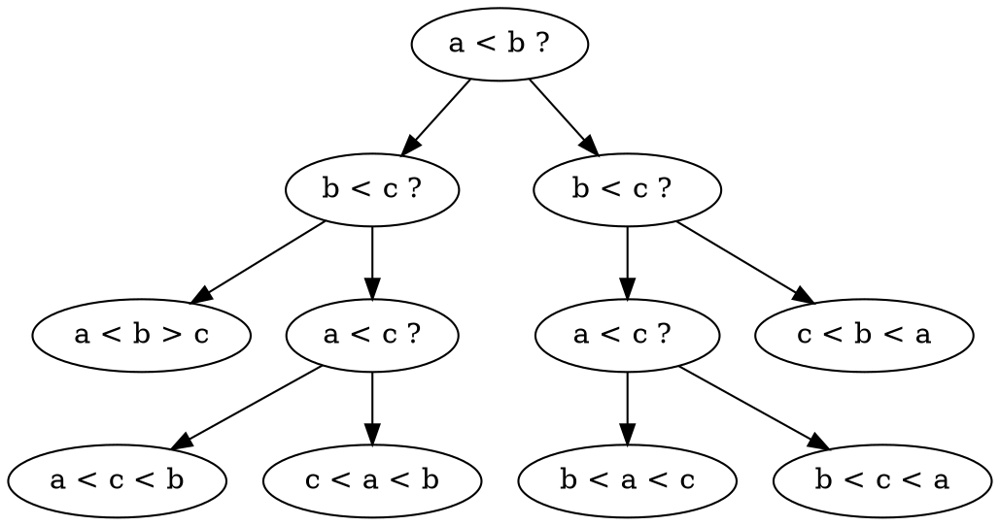

[ALGO] Complexite des algorithmes (7)
===

## IntroSort

On fait un QuickSort en le limitant a $c log_2n$ appels recursifs. S'il y en a plus, s'il y en a plus on fait le tri avec HeapSort

```
IntroSort():
    dmax <- c|log_2n|
    IntroSortRec(A, 0, n, dmax)
    
IntroSortRec(A, b, e, d):
    if e - b > 1:
        if d == 0
            HeapSort(A, b, e)
        else
            m <- Partition(A, b, e)
            d--
            IntroSortRec(A, b, m, d)
            IntroSortRec(A, m, e, d)
```

> Ou c = 2




Tous les ordres sur les n valeurs $\Rightarrow$ Il y a au moins $n!$ feuilles.
- L'arbre fait au moins $log_2(n!)$ comparaisons, d'ordre $\Theta(n log n)$
- Le pire cas $\Omega(n log n)$ comparaisons

## CountingSort

> N'a de sens que si il y a plusieurs repetitions de memes nombres

|A|1 2 1 0 2 1 1 0 2|
|:---:|:---:|
|C|Histogramme|
|C|2 4 3|
|C'|2 6 9|
|B|Resultat|
|C|2 6 8|
|B|x x x x x x x x 2|
|C|1 6 8|
|B|x 0 x x x x x x 2|
|C|1 5 8|
|B|x 0 x x x 1 x x 2|
|C|1 4 8|
|B|x 0 x x 1 1 x x 2|
|C|1 4 7|
|B|x 0 x x 1 1 x 2 2|
|C|0 4 7|
|B|0 0 x x 1 1 x 2 2|
|C|0 3 7|
|B|0 0 x 1 1 1 x 2 2|
|C|0 3 6|
|B|0 0 x 1 1 1 2 2 2|
|C|0 2 6|
|B|0 0 1 1 1 1 2 2 2|


```
// On suppose ∀i∈[0,n[,0≤A[i]<k
CountingSort(A, n, k):
    for i <- 0 to k - 1:
        C[i] <- 0
    for i <- 0 to n - 1:
        C[A[i]] <- C[A[i]] + 1
    for i <- 1 to k - 1:
        C[i] <- C[i] + C[i - 1]
    for i <- n - 1 down to 0:
        C[A[i]] <- C[A[i]] - 1
        B[C[A[i]]] <- A[i]
    return B
```

|Ligne de code|Cout|
|:--:|:--:|
|for i <- 0 to k - 1:|$\Theta(k)$|
|C[i] <- 0|$\Theta(k)$|
|for i <- 0 to n - 1:|$\Theta(n)$|
|C[A[i]] <- C[A[i]] + 1|$\Theta(n)$|
|for i <- 1 to k - 1:|$\Theta(k)$|
|C[i] <- C[i] + C[i - 1]|$\Theta(k)$|
|for i <- n - 1 down to 0:|$\Theta(k)$|
|C[A[i]] <- C[A[i]] - 1|$\Theta(k)$|
|B[C[A[i]]] <- A[i]|$\Theta(k)$|
|return B|$\Theta(1)$|
|Total|$\Theta(n + k)$|

## RadixSort

Pour trier n valeurs $\in [0, 99999[$
On a fait $5 \times \Theta(n) = \Theta(n)$

### RadixSort MSD (Most Significant Digit)

- En base 2 = BinaryQuickSort

||
|:--:|
|01110|
|00111|
|10101|
|11111|
|00000|
|00101|
|10100|

||
|:---:|
|01110|
|00111|
|00101|
|00000|
|11111|
|10101|
|10100|

**Tri en place** si $S(n) = O(log n)$

> Avec S(n) complexite spaciale

## Resume de tous les tris

|Tri|Complexite temporelle|cas general|Complexite spatiale|en place|stable|Utilite|
|:---:|:---:|:---:|:---:|:---:|:---:|:---:|
||best \| any \| worst|any||
|SelectionSort||$\Theta(n^2)$|$\Theta(1)$|1|0|
|InsertionSort|$\Theta(n)$ \| $\Theta(n^2)$ \| $\Theta(n^2)$|$O(n^2)$|$\Theta(1)$|1|1|petits tableaux|
|MergeSort||$\Theta(nlogn)$|$\Theta(n)$|0|1|seul $nlogn$ stable|
|HeapSort||$\Theta(nlogn)$|$\Theta(1)$|1|0||
|QuickSort|$\Theta(nlogn)$ \| $\Theta(nlogn)$ \| $\Theta(n^2)$|$O(n^2)$|$\Theta(logn)$|1|0|
|IntroSort||$\Theta(nlogn)$|$\Theta(logn)$|1|0|
|||||
|CountingSort|bien si le = $O(n)$|$\Theta(n+k)$|$\Theta(n+k)$|0|1|nb fixe de valeurs a trier|
|RadixSort||$\Theta(n)$|$$\Theta(n)$|0|1 si Counting|