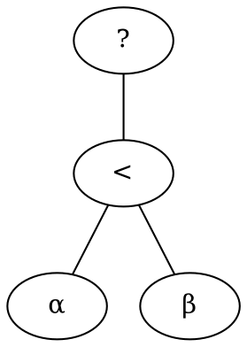

[CMP2] Construction des compilateurs (1)
===

**==Enjeux==**  
- Linearisation
- Allocatin des registres
- Gestion de la pile 

# Intermediate Representations

## Compiler structure

**front end** : scanner-parser-ast-binder-typechecker, optimisations specifiques au langage source, generation de hir (langage intermediaire) $\implies$ Analyse du langage source

**middle end** : Faire le lien avec le back-end (lir -> hir -> backend)

**back end** : Generer du code assembleur + allocation des registres, optimisations (langage de sortie)

Il y a plusieurs **IR**, on divise ca en plusieurs traducteurs $\implies$ desucrage

++Exemple++ : Enlever la couche objet, enlever le support des fonctions variadiques, remplaces les for par des while 

- Intermediate language-based strategy : Differents niveaux d'abstraction d'un meme language (SmartEiffel, GHC)
- Bytecode strategy : On finit la compilation avec une VM (Java bytecode JVM)
- Retargetable optimizing backend : VPO (Very portable optimizer), C-- (Quick C--)
- Modular Systems : LLVM (compiler as a library, centered on a typed IR) > contains Clang, LLDB...

## Intermediate representations

- Imperative ? 
	- Stack-based (ex: Java Bytecode) ? Register Based (ex: gcc's rtl) ?
- Functional ?
- Keep arrays ?
- Keep loops constructs or keep only one ? 
- Level of machine independence ?
	- Explicit register names ? (No)

**Differents niveaux**

```
float a[20][10];
a[i][j+2];
```

```
t1 <- a[i, j+2]
```

```
t1 <- i + 2
t2 <- i * 20
t3 <- t1 + t2
t4 <- 4 * t3
t5 <- addr a
t6 <- t5 + t4
t7 <- *t6
```

- Cas de GCC


### Stack-based

Pros : 
- Trivial translations of expresssions, trivial interpreters, no pressure on registers, ofter compact

Cons : 
- Does not fit today's architectures, hard to analyse, hard to optimize

### Register-based

> Plus verbeux  
> Prologue et epilogue (sauvegarder et restaurer les registres)

Pro : 
- Plus proche de l'assembleur
- Suits today's architecture, clear data flow

Cons : 
- Harder to syntesize, less compact, harder to interpret

### Tree

> Langage intermediaire


> sxp : Call d'une fonction sans recuperer la valeur de retour

## Memory managment

> On doit travailler avec 17 registres

**Cas de la recursion**

- A single routine can be opened several times concurrently
- We call **activation** a single instance of execution
- Automatic vars are bound to the liveliness of the activation
- Their location is called *activation block*

### Activation block

**Content**

- Arguments
- Local variables
- Return address
- Saved registers (caller's environment to restore)
- Temp
- Static link

> Le layout (l'ordre de ces parties) est impose par le processeur

++Exemple (mips)++  


> fp : frame pointer (partie haute)  
> sp : stack pointer (partie basse)  
> Le bloc d'activation est situe entre sp et fp

### Nonlocal variables


> sl : static link  
> Par convention, on place le sl au debut du bloc d'activation  
> $\implies$ En derefenrencant le debut du bloc d'activation courant = on obtient le bloc d'activation de notre parent syntaxique

Ici $F_{22}$ n'a pas le droit d'appeler $F_{11}$ > ca casse au niveau du binder

## Translation to Intermediate Language

### Calling conventions

> Que mettre dans un bloc d'activation

- Preserve some registers (fp, sp)
- Allocate frame
- Handle static link
- Receive arguments

### Clever translations

Translation for $\alpha < \beta$ ?



- $\alpha < \beta$
> On doit executer α et β pour leurs effets de bords

```
seq (sxp (α)
     sxp (β))
```

- $a = \alpha < \beta$

```
eseq (seq (cjump (α < β, ltrue, lfalse),
	       label ltrue
		   move temp t, const 1
		   jump lend
		   label lfalse
		   move temp t, const 0
		   label lend),
	  temp t)
```

- $if\ \alpha < \beta$

```
cjump (α < β, ltrue, lfalse)
```

Solution : Delay the translation until its use is kmown > **prototranslation**

- *Ex* : Expression shell, encapsulate a proto value
- *Nx* : Statement shell, encapsulate a wannabe statement
- *Cx* : Condition shell, encapsulate a wannabe condition

The parent finishes the translation : 


> Essayer de traduire un statement en expression ou condition = erreur de sementique > on raise une erreur

### Complex Expressions

> Array creations, record creation, strings, while, for

#### Additionnal features

- Bound checking : A chaque fois qu'on accede a un indice, on verifie qu'on respete les bornes
- Nil checking : Verifie si on dereference un pointeur null


## Linearisation

### lir : Low Level Intermediate Representation

> hir vers lir

hir constructs not supported in assembly : 
- Structure : no nested strucutres
- Expressions : Assembly is imperative
- Calling conventions : High level calls are not simple instructions
- Two way conditional jumps
- Limited number of registers

Principe de linearisation : 
- Objectif : virer les imbrications
- eseq and seq must be eliminated (except the outermost seq)
- Similar to cut-elimination : permute inner eseq and seq to lift them higher until they vanish

++Exemple++  
```
eseq (s1, eseq(s2, e)) > eseq(seq(s1, s2), e)
sxp(eseq(s, e)) > seq(s, sxp(e))
```

More rules 
```
seq(ss1, seq(ss2), ss3) > seq(ss1, ss2, ss3)
call(f, eseq(s, e), es) > eseq(s, call(f, e, es))
binop(+, eseq(s, e1), e2) > eseq(s, binop(+, e1, e2))
binop(+, e1, eseq(s, e2)) > 
```

### Transformation en basic block

```
a <- 41
b <- [x] #mem access
c <- 1
cjump L1
L1: cjump c != 10, L7, L9
L2: jump L1
L3: cjump b > 0, L2, L6
L4: b <- d
L5: jump L2
L6: cjump b < 0, L2, L5
L7: c <- x + 4
c < c + 1
d <- [x]
cjump b != d, L4, L8
L8: cjump b == 0, L2, L3
L9: a <- a + 1
```

- Bloc doit commencer par un label
- Interdit d'avoir 2 labels dans un basic block

```
LX: a <- 41                |
b <- [x] #mem access       |
c <- 1                     |  BLOC B1
cjump L1                   |

L1: cjump c != 10, L7, L9  |  BLOC B2

L2: jump L1                |  BLOC B3

L3: cjump b > 0, L2, L6    |  BLOC B4

L4: b <- d                 |
    jump L5                |  BLOC B5
    
L5: jump L2                |  BLOC B6

L6: cjump b < 0, L2, L5    |  BLOC B7

L7: c <- x + 4             |
    c < c + 1              |
    d <- [x]               |  BLOC B8
    cjump b != d, L4, L8   |
    
L8: cjump b == 0, L2, L3   |  BLOC B9

L9: a <- a + 1             |
    jump end               |  BLOC B10
```

Ordonner les blocs
> Stategie naive : on commence par les blocs les plus "simples" finissant par un ``jump``
```
B1  # -> blocs simples
---
B10
---
B9
---
B6
---
B5
---
B3 # <- blocs simples
---
B2   cjump c==0, L9, L7
--- 
B8
---
LX1: jump L8
```
