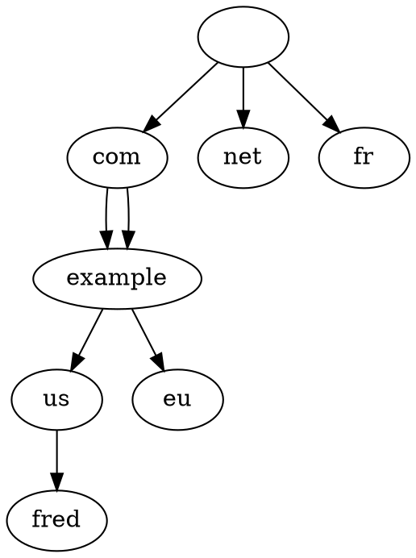

[NET1] Reseaux (6)
===

# DNS

**DNS (Domain Name System)** : Traduit des noms de domaine en addresses IP

- Noms de domaines organises de maniere hierarchique
- Sous forme d'arbre 

**Nom entierement qualifie** : fred.us.example.com.

**FQDN** : Fully Qualified Domain Name

:::danger
Ne pas oublier le '.' a la fin d'un nom entierement qualifie
:::

**TLD (Top-Level Domain)** : 
- Ici com, net et fr

---
- Le DNS n'a autorite sur rien
- 13 serveurs racines
- Les serveurs sont autoritatifs s'ils gerent une zone

**Resolver** : Le serveur qui convertit les noms de domaines en IP

**Zone File** : Fichiers de configuration DNS

> Metadata des zone file decrits dans les records SOA
> Dans une zone file, le @ est remplace par la valeur de $ORIGIN

*Delegation d'un subdomain* : RR NS (Name Serveur)

---
Port S3 : UDP (petites requetes) + TCP (grosses requetes)

> Autorite sur la DNS root zone : ICANN

### Requetes DNS

2 types de requetes : 
- Requetes recursives : resolvent toute l'addresse a coup d'appels a des serveurs de zone
- Requetes iteratives

#### Requetes recursives

Si le serveur ne connait pas le nom de domaine, appelle un autre serveur sous lui

++Exemple++ :
On cherche example.com
1. Machine perso -> DNS serveur : demande l'adresse d'un nom de domaine
	- DNS serveur : Non (sauf s'il a en cache)
2. DNS serveur -> Serveurs a la racine (autoritatifs) : renvoie un referent ("va voir com")
3. DNS serveur -> Serveur exemple.com : renvoie l'IP ['']

> 8.8.8.8 : serveur recursif (resolveur DNS de Google)

### Serveurs Master-Slave

Serveur **master** : possede la configuration
Serveurs **slave** : copie de la configuration du master tous les x temps
> Un serveur slave est autoritatif sur sa zone