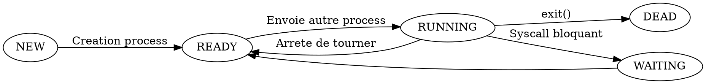

[SYS1] Systemes d'exploitation (4)
===

## Contenu d'un process 
- pid 
- uid / gid
- Address space
- fdtable
- signal : signaux a serveurs | handlers

## Signaux

- SIGTERM : Demande au process de stop
- SIGKILL : Detruit un processes et tous ses enfants

### Gestion des erreurs

```
rc = write(...);
perror();
```

```
int handler() {
    open(...);
}
```

> Valeur d'errno globale

### Allocation de fd

```
struct file *fdtable[]; // fd est l'index dans fdtable
```

- On prend le plus petit fd libre

## Redirections
Exemple : cat > file

++Facon un peu nulle mais ca marche++ : 
```
fork()
    close(1) //stdout
    open('file')
execvp
```

++Meilleure facon++ : 
- On utilise dup
- **dup(oldfd)** : Duplique un fd existant
- **dup2(oldfd, newfd)** : Close newfd (Avec O_CLOEXEC) et le remplace par oldfd
    - Equivalent a faire "close(newfd); open(oldfd);"

> **fcntl** permet de set des proprietes sur un fichier (dont O_CLOEXEC)

```
fork()
    dup(open("file"))
    close(1)
execvp
```

#### Redirection stdout
- cat > toto : 
```
open("toto")
dup2(fd, 1)
```

#### Redirection stderr

- cat 2> toto : 
```
open("toto")
dup2(fd, 2)
```

#### Pipe

- cat | cat2
**pipe(int fd[2]);**

> On a un buffer, fd[0] ecrit et fd[1] lit

```cpp
fork()
// p1
    fd[0]
    close(fd[1])
    dup2(fd[0], 1)
    fork()
        execvp('cat')

// p2
close(fd[0])
fd[1]
dup2(fd[1], 0)
execvp('cat2')//?
```

## Etats des process

Le process peut etre dans 2 etats : 
- RUNNING
- READY



**Syscall bloquants** : sleep, wait, read, write, etc
Etat **DEAD** : Process termine mais un autre process a appele wait() dessus

**init()** (pid = 1) : cree un programme P1 a la racine de tous les autres

Process P1 et son child P2
- P2 exit
- P2 envoie un signal SIGCHILD a P1

Process orphelin : rattache a init

### Uid / Gid d'un process

0777 : permission user / group / other
**Bit setuid** : Premier bit des permissions
- Quand on lance le programme, il n'est pas lance avec nos permissions mais avec celles de l'owner du programme

++Exemple++ : 
17777 root : Lance le programme avec les permissions de root
sudo v $user prg -> /etc/sudoers