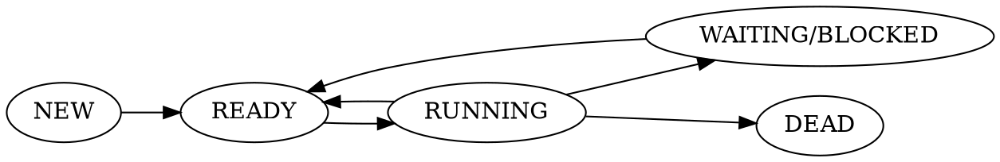

[SYS1] Systemes d'Expoitation (6)
===

# Scheduling

> Dans un batch system

### Objectifs

- Maximiser l'optimisation CPU
- Debit important (throughput)
- Execution Time
- Turn around Time (le rendre proche de l'execution time)
- Eviter les situations de famine (starvation)
- Equitable

### Metriques

- Turnaround Time : NEW->DEAD
- Execution Time : RUN
- Strating Time : NEW->RUN
- Waiting Time : READY

**Algorithme preemptif** : Arrete des taches
	- Avec un timer et des interruptions materielles
	
**RR (Round Robin)**
- READY Queue
- Definit un Time Quantum : temps pendant lequel on fait tourner l'application avant de passer a la suivante

**Tache interactive** :
- Execute beaucoup de syscalls
- IO-Bound

**Tache Non-Interactive** : 
- CPU-Bound

> **Bottleneck** : facteur limitant qui empeche d'etre a un debut maximal

