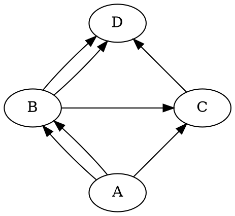
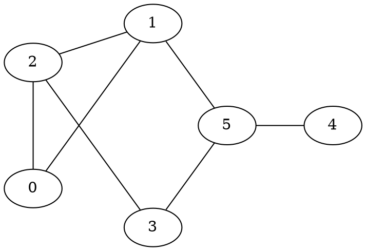
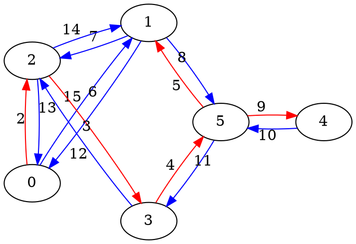
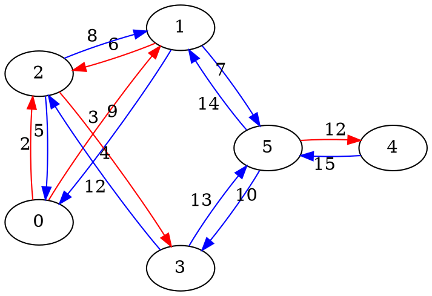
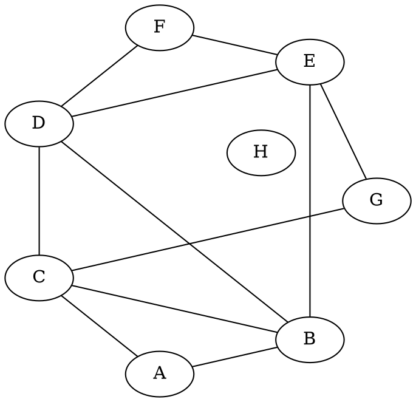

[THEG] Theorie des graphes (2)
===

> BFS / DFS
> 
## Representation des graphes

### Representation mathematique
++Representation traditionnelle++ : 

$V$ : ensemble des sommets  
$E \subseteq X \times V$ : ensemble des aretes

$\implies$ Interdit les doublons  
$\implies$ Ne peut pas representer tous les graphes

++Exemple++ :  


$\{\{(A,B), (A,B), (A,C), (B,C), (B,D), (B,D), (C,D)\}\}$

Si le graphe est **non-oriente** :  
- $(x, y) \in E$ signifie que soit $(x,y)$ soit $(y, x)$ est dans E.  
- $succ(x) = \{ y \in V | (x, y) \in E \}$

------------------------------
### Representation sur machine

Sur machine, on a plusieurs facons de representer un graphe : 
- $n \in \mathbb{N}$, **edges = liste(paire($\mathbb{N}, \mathbb{N}$))**
- **Liste d'adjacence** (chaque entree du tableau pointe sur une liste contenant ses successeurs)
- **Matrice d'adjacence** : $M[x,y] = 1 \iff (x,y) \in E$

### Cout des operations sur les graphes  

|Representation|Tester $(x, y) \in E$|Trouver $succ(x)$|Cout de la boucle|
|:--:|:--:|:--:|:--:|
|edges = liste(paire($\mathbb{N}, \mathbb{N}$))|$O(\|E\|)$|$\Theta(\|E\|)$|$\Theta(\|V\|.\|E\|)$|
|Liste d'adjacence|$O(\|succ(x)\|) = O(\|E\|)$|$\Theta(1)$ (retourne la liste)|$\sum_{x \in V}(\Theta(1) + deg(x)) = \Theta(\|V\|) + \Theta(\|E\|))^{(1)}$|
|Matrice d'adjacence|$\Theta(1)$|$\Theta(\|V\|)$|$\Theta(\|V\|^2)$|


```
/* Cout de la boucle */
for x in V : 
    for y in succ(x): // Cout de cette ligne pour tout x
        // ...
```

:::info
**Notes** :  
- $^{(1)}$ Si le graphe est connecte, alors $\|E\| \geq \|V\| - 1$ et $\|E\| = \Omega(\|V\|)$ donc $\Theta(\|E\|) + \Theta(\|V\|) = \Theta(\|E\|)$
- Si le graphe n'a pas d'aretes en double (graphe simple), $\|E\| \leq \|V\|^2$
:::

## Parcours d'un graphe

### DFS (Depth First Search)





<span style="color:red;">$\implies$ Decouverte d'un nouveau succ : forme un arbre couvrant si le graphe est connexe</span>
<span style="color:blue;">$\implies$ Decouverte d'un succ connu</span>

------------------------------
### BFS (Breadth-First Search)



--------
### Code

```python=
def adjlist(n, edges):
    succ = [[] for i in range(n)]
    for (a,b) in edges:
        succ[a].append(a)
        succ[b].append(b)
    return succ
    
def dfs(n, edges, start):
    succ = adjlist(n, edges)
    seen = set()
    def rec(x):
        if x in seen:
            return
        print(x)
        for y in succ[x]:
            rec(y)
        rec(start)
```

```python=
def dfsi(n, edges, start):
    succ = adjlist(n, edges)
    seen = set()
    todo = [start]
    while(todo):
        x = todo.pop()
        if x not in seen:
            seen.add(x)
            print(x)
            for y in succ[x]:
                todo.append(y)
```

Parcours profondeur :  
```python=
def bfsi(n, edges, start):
    succ = adjlist(n, edges)
    seen = set()
    todo = [start]
    while(todo):
        x = todo.pop(0)
        if x not in seen:
            seen.add(x)
            print(x)
            for y in succ[x]:
                todo.append(y)
```

------------------
### Cycle Eulerien

**Cycle** : Chemin qui revient a son point de depart

**Cycle Eulerien** : Cycle qui visite toutes les aretes une fois exactement
> Un graphe est eulerien ssi il existe un cycle eulerien

++Conditions necessaires++ : 
- Tous les sommets sont de degre pair
- Le graphe a toutes ses aretes dans la meme composante (is_edge_connected)



```
A : ABCA
B : BDCGEB
D : DEFD

|ABDEFDCGEBC|A
```

#### Algorithme

1. Choisir un sommet qui touche une arete
2. Faire un DFS "sans backtrack" depuis ce sommet X. On s'axe necessairement sur X
3. Chercher sur le cycle construit des sommets avec aretes non vues
4. Repeter 3 jusqu'a ce qu'on ait vu toutes les aretes