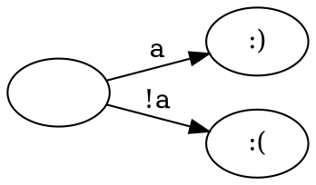
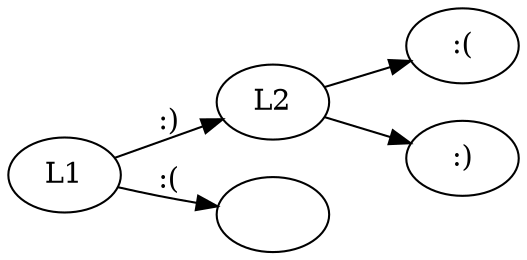
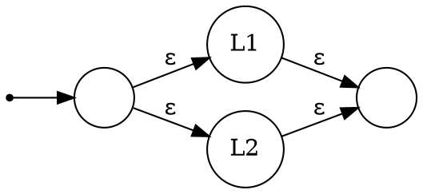
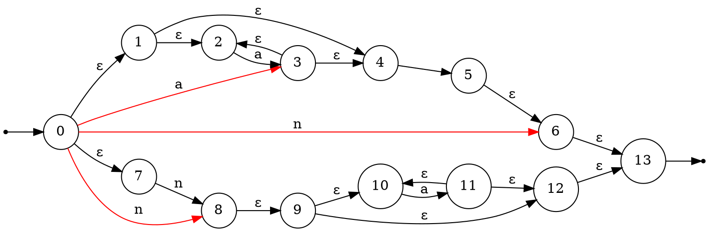
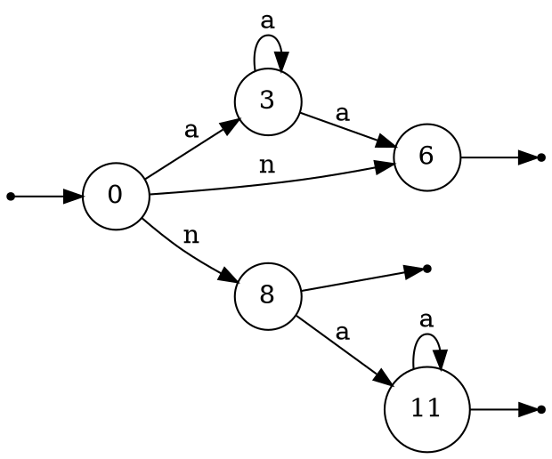

[THL] Theorie des langages (2)
===

## Automates

$\varnothing \to \varnothing \Rightarrow\ \  \to o\ \ \ o\to$
$\{\varepsilon\} = \varepsilon \Rightarrow\ \ o\overset{\varepsilon}{\to} o\to$
$\forall a \in \sum \{a\} \to a \Rightarrow$

----------------
Concatenation . : 

**Machine a etats** : $(Σ, Q, ICQ, FCQ, S)$
> Σ : Langage
> Q : Etats
> ICQ : Etats d'entree
> FCQ : Etats finaux
> S : Transitions

Automate de $L_1 \cup L_2$

---
### Automate deterministe
> Objectif : rendre cet automate deterministe

$a^*n + na^*$

**Epsilon fermeture** : tous les etats auquels om peut acceder sans consommer de charactere

> On liste les etats et leurs transitions epsilon

|εf()|1|2|3|
|:--:|:--:|:---:|:---:|
|0|0, 1, 7|0, 1, 2, 4, 7|0, 1, 2, 4, 7|
|1|1, 2, 4|1, 2, 4, 5|1, 2, 4, 5|
|2|2|2|2|
|3|3, 2, 4|3, 2, 4, 5|3, 2, 4, 5|
|4|4, 5|4, 5|
|5|5|5|5
|6|6, 13|6, 13|6, 13|
|7|7|7|7|
|8|8, 9|8, 9, 10, 12|8, 9, 10, 12, 13|
|9|9, 10, 12|9, 10, 12, 13|9, 10, 12, 13|
|10|10|10|10|
|11|11, 10, 12|11, 10, 12, 13|12, 13|
|12|12, 13|12, 13|12, 13|
|13|13|13|13|

++Resultat++ :

Un etat est dit **utile** si il est a la fois accessible et co-accessible
**Emonder** un automate : Supprimer les etats non-accessibles ou non co-accessibles
- Etat **accessible** : Il existe un mot faisant passer l'automate de l'etat initial a cet etat (on peut acceder a cet etat depuis l'entree)
- Etat **co-accessible** : Il existe un mot faisant passer l'automate de cet etat a un etat final
