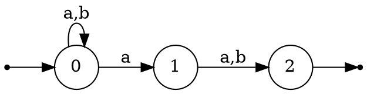
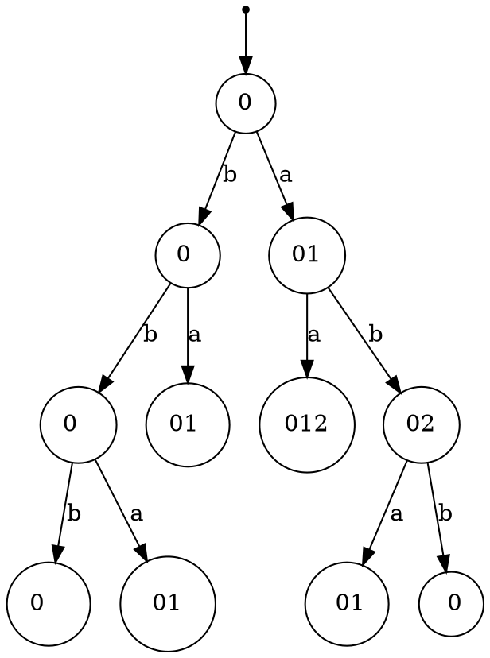
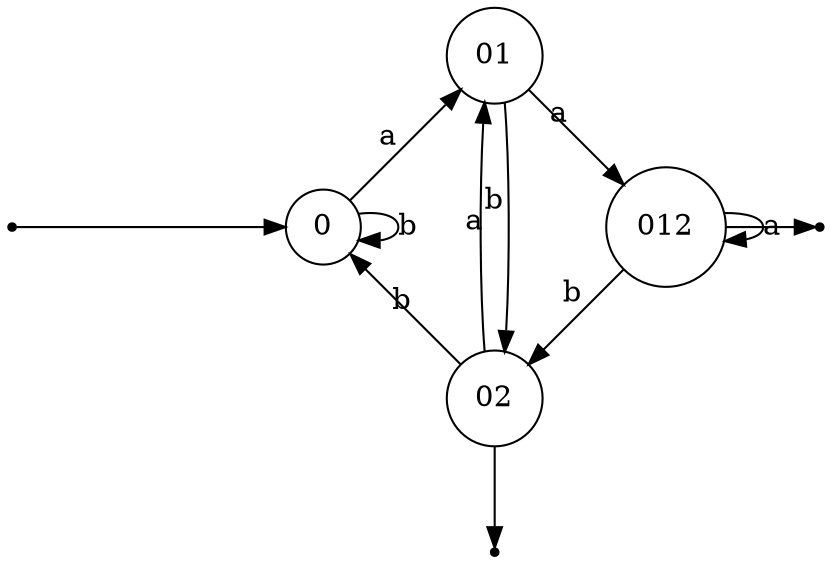

[THL] Theorie des langages (3)
===

[// notes de cours](https://www.lrde.epita.fr/~akim/thl/lecture-notes/)

**Automate a etats finis** : Possede un nombre fini d'etats
$$(a+b)^*a(a+b)$$

Peut se transcrire en l'automate infini suivant

Automate deterministe a etats finis (DFA) : 

$$(\sum, Q, \underset{i \in Q}i, \underset{F \subset Q}F, S)$$
> On a plus qu'une seule entree
> Plus qu'un seul choix possible par etat $Q \times \sum \to Q$

-> Programme de complexite lineaire

Table de transition DFA : 
|T|a|b|
|:--:|:--:|:--:|
|0|1|0|
|1|2|3|
|2|2|3|
|3|1|0|

> Ou 0:0 01:1 012:2 12:3

Table de transition depuis NFA: 
|T|a|b|
|:--:|:--:|:--:|
|0|01|0|
|01|012|02|
|012|012|02|
|02|01|0|

L.Rat -> Expr Rat -> $\varepsilon$NFA -> NFA -> DFA

> Algorithme de Boyer-Moore

---
2 derniers symboles vus par noeud
|T|a|
|:--:|:--:|
|0|bb|
|01|ba|
|012|aa|
|02|ab|

## Memoire de l'automate

$\forall n \in N$
$\sum = \{a, b\}$
$L = a^nb^n$

Les automates (Expr Rat -> $\varepsilon$NFA -> NFA -> DFA) ne marchent que sur des langages rationnels.

==**Lemme de pompage**==
Condition necessaire de rationalite

> Le complementaire preserve la rationnalite
